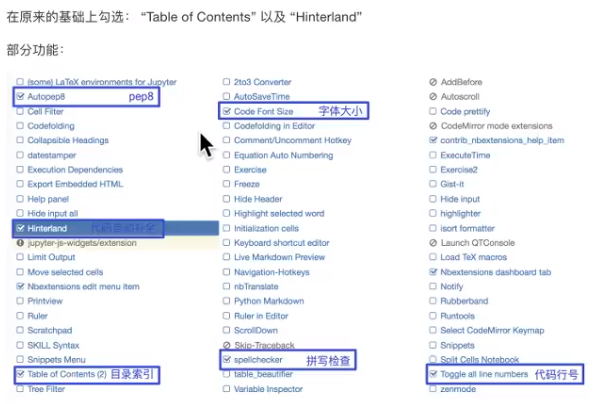

### 一、机器学习基础环境安装

#### 1.新建一个虚拟环境
```
@ set python3_bin=C:\Python37\python.exe
@ set python3_venv=C:\Python37\venv\

@rem 安装支持虚拟环境的包virtualenvwrapper
@ pip list | findstr virtualenvwrapper >nul || pip install virtualenvwrapper-win

@rem 指定虚拟环境创建目录
@ mkdir %python3_venv% >nul 2>nul
@ setx WORKON_HOME %python3_venv% /m
@ start mkvirtualenv -p %python3_bin% ai
```

#### 2.安装`Matplotlib`、`Numpy`、`Pandas`、`jupyter `
```
@rem 激活环境
@ workon ai

@rem 安装运行环境(必须手动执行)
@ pip install -r requirements.txt

@rem 退出环境
@ deactivate

@rem 删除环境
@rem rmvirtualenv ai
```

#### 3.使用`jupyter notebook`
```
@rem 进入开发目录
@ cd /d xxx

@rem 进入虚拟环境
@ workon ai

@rem 输入命令
@ jupyter notebook
```

##### - 修改字体
  在`C:\Python37\venv\ai\Lib\site-packages\notebook\static\custom\custom.css`中，添加：
```
* {
  font-family: Consolas, "Microsoft YaHei Mono", "Microsoft YaHei";
}
```

##### - 安装插件

```
@ pip install jupyter_contrib_nbextensions -i https://pypi.tuna.tsinghua.edu.cn/simple
@ jupyter contrib nbextensions install --user --skip-running-check

@rem 支持自动补全代码
@ pip install autopep8
```
进入网页`http://localhost:8888/nbextensions?nbextension=toc2/main`，配置：


